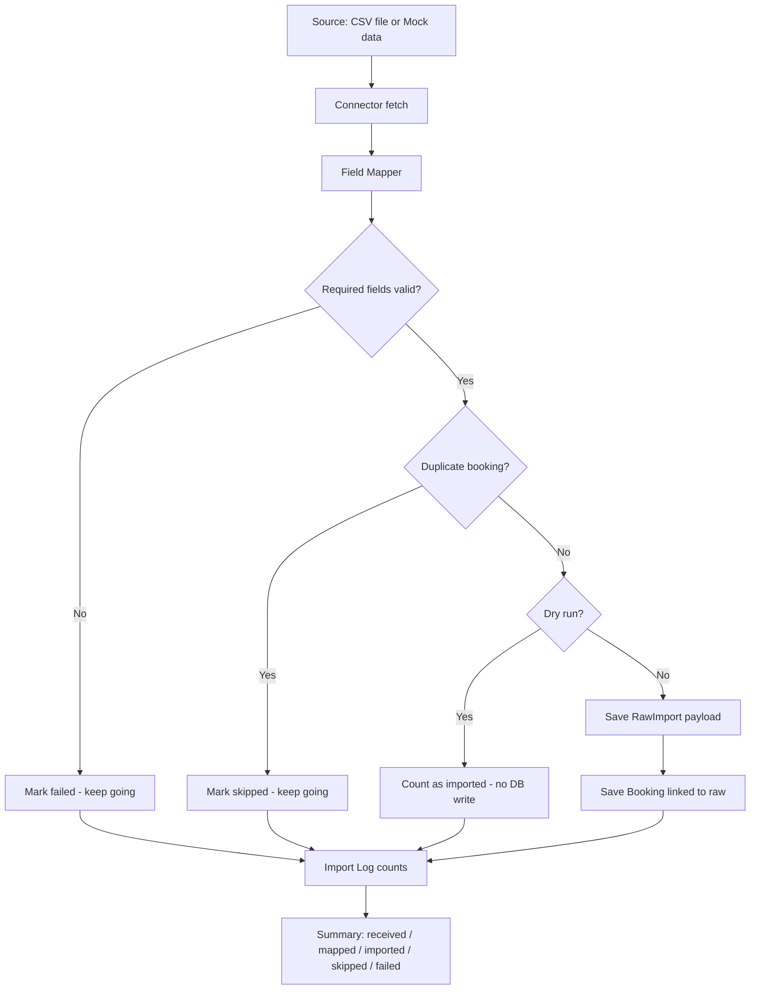
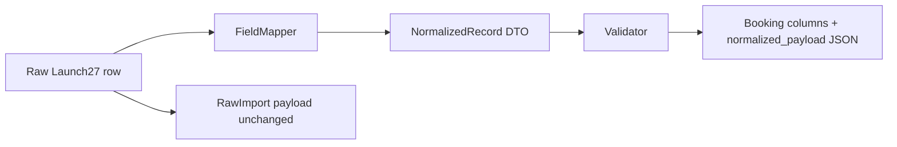

# SEEKLY Technical Trial — Design Approach

**Project:** Sandbox Connector Framework (Launch27 CSV trial)  
**Document purpose:** Share how our team built this trial, what design choices we took, and why each part is useful.

This document covers the technical trial implementation prepared by our development team for SEEKLY review.

---

## 1. Technical trial target

The target for this technical trial was to build a reusable Laravel connector-style import for Launch27 CSV data (using the sample files and mapping documents shared with us), and cover these points:

- Import Launch27-style data in a safe way
- Keep the original payload as received
- Create one normalized operational record linked back to that payload
- Validate required fields, detect duplicates, support dry-run, and write an import log
- Support mock, CSV, and a future live connector mode without changing the main import flow

We followed the assigned mapping and related trial requirements for this version. The structure is kept simple so it can move into the existing Laravel Sandbox in the next phase with less rework.

---

## 2. End-to-end flow

**In simple terms:**  
We take each row from the source, map it to our internal format, validate it, check if it is already imported, and then either save it or only show what would have happened (dry-run). At the end we write one import log so the team can see received, mapped, imported, skipped, and failed counts.

---

## 3. SOLID principles in this trial

Our team applied SOLID in a practical way — mainly to keep the code easy to maintain and extend, not to over-design.

For day-to-day ownership, we kept each class focused on one job. That is the Single Responsibility split we used:

| Piece | Job |
| ----- | --- |
| `CsvConnector` / `MockConnector` | Get rows from a source |
| `FieldMapper` | Convert Launch27 fields → SEEKLY shape |
| `Validator` | Check required fields |
| `RawPayloadService` | Store original payloads only |
| `DuplicateService` | Check if this booking was already imported |
| `ImportService` | Run the full import steps in order |
| Controller / Artisan command | Take input and show results |

So if mapping rules change later, we mostly update `FieldMapper`. We do not need to touch CSV reading or the save logic for that.

Around that, the rest of SOLID is applied in a straightforward way. Import runs through `ConnectorInterface`, so CSV and Mock (and later Live) can be swapped without rewriting `ImportService`. Any connector that follows the same methods can be passed into `run()` — we do not put `if ($mode == 'csv')` style checks inside the service. The interface itself is kept small (`name`, `mode`, `fetch`, `map`, `validate`) so a connector is not forced to implement things we do not need in this trial. Controllers and commands stay thin; they build the connector and call the service. Business flow sits in `ImportService` and the related helper services, which makes testing and Stage 2 extension easier for the team.

---

## 4. Main building blocks

### 4.1 Connector interface

This is the common contract for every data source.

**Why we use it:** The trial needs a reusable connector layer. One interface means Launch27 CSV works today, and another driver can be added later without changing the import pipeline.

### 4.2 Connector modes (Mock / CSV / Live)

| Mode | Role |
| ---- | ---- |
| Mock | Sample rows in code — useful for quick checks without uploading a file |
| CSV | Main trial driver using the shared Launch27 sample CSV |
| Live | Placeholder for a future Launch27 API connector |

**Why it matters:** Mode separation was part of the trial target. The design is not locked only to file upload.

### 4.3 DTOs (`NormalizedRecord`, `ImportResult`, `ImportError`)

We pass structured objects between layers instead of loose arrays everywhere.

**Why we use them:**

- Mapped booking data has a clear shape
- Validation and save use the same object
- UI and CLI get the same import summary and error details

### 4.4 Raw payload preservation (`RawImport`)

For each accepted row we store the original data as JSON, along with a checksum and batch id.

**Why it is important:**

- Audit — we can see exactly what came in
- Debugging — if mapping looks wrong, we can compare with source
- Future remapping — if mapping rules change, old payloads can be reused
- Recovery — original data is not lost after normalization

### 4.5 Normalized operational record (`Booking`)

One booking is created per imported row, linked with `raw_import_id`.

**Why it is important:** SEEKLY features need a stable internal record. We mapped the assigned trial fields from the shared schema documents (booking id, customer, service, status, checklist/time/notes flags, simplified eligibility, mapper version) into this record.

### 4.6 Validation

After mapping we check required fields such as booking id, customer, service date, and service name. If a row fails, it is marked failed and the rest of the file still continues.

**Why it is important:** One bad row should not stop the full import. Failed rows still show up clearly in the summary.

### 4.7 Duplicate detection

We identify duplicates using **connector + source booking id**. This is checked against already stored raw imports, and also within the same run (including dry-run).

**Why it is important:** If the same CSV is imported again, we should not create duplicate bookings. Skipped rows are recorded with a clear reason.

### 4.8 Dry-run

Dry-run runs the same steps (map, validate, duplicate check, summary) but does not write raw imports or bookings. The import log is still created.

**Why it is important:** The team can verify validation, mapping, and duplicates before doing a real write.

### 4.9 Import / sync log

Every run stores received, mapped, imported, skipped, and failed counts, plus connector, mode, batch id, and timing.

**Why it is important:** We get a clear history of each import without searching application logs.

---

## 5. Field mapping strategy

### Strategy: dedicated mapper with version tag

We did not put Launch27 column names inside the controller or scatter them across the import service.

Flow we follow:

1. Connector returns the raw row as received  
2. `FieldMapper` converts it into `NormalizedRecord`  
3. `Validator` checks the mapped record  
4. We save both the raw JSON and the booking columns  

This follows the shared field-mapping approach: **one mapping place, one normalized record**, with a **mapper version** (`1.0-trial`) so we know which mapping produced the record.

### How fields are handled in this trial

| Approach | Example |
| -------- | ------- |
| Direct rename / copy | Launch27 `id` → `source_booking_id`; `customer_id` → `customer_id` |
| Combine values | `service_date` + `scheduled_time` → `scheduled_at` |
| Derive flags | checklist count → `has_checklist`; minutes → `has_time_tracking` |
| Derive status | completed / cancelled / booking_status → internal `status` |
| Simplified eligibility | proof = completed + checklist; sla/risk = completed |
| Privacy | Customer name stored as a masked demo label |

Only the assigned mapping and related trial fields are used in this version.

---

## 6. How one import run works

When import starts (from UI or Artisan), `ImportService` gets the selected connector and starts a batch.

For each row it asks the connector to map the data, then validates the mapped record. If validation fails, that row is counted as failed and the next row continues. If the booking id was already imported (or already seen in this same run), the row is skipped. Otherwise, in a normal run we save the raw payload first and then save the linked booking. In dry-run we only update the counts and do not write those tables.

After all rows are processed, we write one import log and return the summary to the UI or console.

---

## 7. Feature summary — why each part exists

| Feature | Why we built it | Why it is useful |
| ------- | --------------- | ---------------- |
| Connector interface | One contract for every source | Easy to add more connectors later |
| CSV connector | Works with the shared sample CSV | Real file import for the trial |
| Mock connector | Quick run without a file | Easy demo and smoke testing |
| Live placeholder | Same interface ready for API later | Live mode can be added without redesign |
| Raw preservation | Keep source data as received | Audit, debug, remap, recovery |
| Normalized booking | Stable internal record | Consistent data for next features |
| Field mapper | Launch27 → SEEKLY mapping in one place | Mapping changes stay isolated |
| Mapper version | Tag which mapping was used | Helps with remapping later |
| Validation | Catch bad rows early | Import quality without stopping the batch |
| Duplicate detection | Natural key on booking id | Safe re-import of same file |
| Dry-run | Preview before write | Check results before saving data |
| Import log | Counts for every run | Clear visibility for each import |
| DTOs | Typed data between layers | Less confusion than raw arrays |
| Thin controller | UI only wires connector + service | Business logic stays in services |

---

## 8. Closing

This technical trial covers the agreed connector interface, Launch27 CSV import, raw payload storage, normalized booking linkage, dry-run, validation, duplicate handling, and import logging.

Our development team kept the design reusable and easy to extend for the next phase of the SEEKLY Sandbox Connector Framework. We are happy to walk through the code or a sample import run during review.
